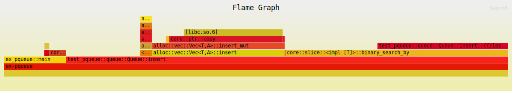
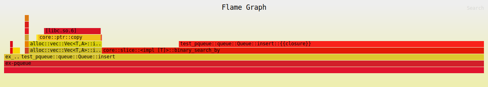

While trying to optimize a custom bounded priority queue, I ran into a pathological case and I digged deeper and deeper to try to
understand the issue. At one point I decided to collect the data and write this article to share my journey. You can find the repo
[here](https://github.com/CAT-Solstice/test-pqueue).

---

Here are the results of two benchmarks using [`criterion`](https://crates.io/crates/criterion) to justify the click-bait-y title.
Running the benchmark using `opt-level=3` introduces a performance penalty of +123% vs `opt-level=2`. Though you should probably not
use `opt-level` like this with `criterion`, it is an easy way to make the point.

```
RUSTFLAGS="-C target-cpu=haswell -C opt-level=2" cargo bench
[...]
pqueue-insert/Priority Queue Insert
  time:   [963.15 ns 963.36 ns 963.56 ns]
Found 253 outliers among 10000 measurements (2.53%)
  7 (0.07%) low mild
  229 (2.29%) high mild
  17 (0.17%) high severe
```

```
RUSTFLAGS="-C target-cpu=haswell -C opt-level=3" cargo bench
[...]
pqueue-insert/Priority Queue Insert
  time:   [2.1536 µs 2.1540 µs 2.1545 µs]
  change: [+123.53% +123.60% +123.66%] (p = 0.00 < 0.05)
  Performance has regressed.
Found 203 outliers among 10000 measurements (2.03%)
  11 (0.11%) low mild
  185 (1.85%) high mild
  7 (0.07%) high severe
```

I'm targeting [Haswell](https://en.wikipedia.org/wiki/Haswell_(microarchitecture)) architecture because it's wildly available and
support AVX2, FMA3 and BMI2. I ran this benchmark on an AMD Zen 3 5800X and an Intel 4790 (non-K) - an actual Haswell CPU - with the
same behavior.

# What the hell am I doing?

The [example](https://github.com/CAT-Solstice/test-pqueue/blob/main/examples/ex-pqueue.rs) and the [bench](https://github.com/CAT-Solstice/test-pqueue/blob/main/benches/pqueue_bench.rs)
are building a top-k of distinct pair-like `(id, dist)` elements from a collection of random elements. The constraint of unicity over
`id` make the use of a binary heap unefficient, so instead I maintain a sorted `Vec` inserting new element at the correct position.

```rust
#[derive(Debug, Clone, Copy)]
pub struct Neighbor {
  pub id: u32,
  pub dist: f32,
}

pub struct Queue {
  neighbors: Vec<Neighbor>,
  capacity: NonZeroUsize,
}
```

The queue is using a [binary search](https://doc.rust-lang.org/std/primitive.slice.html#method.binary_search_by) on the vec tofind
the position to insert new element. They should be ordered by `dist` then by `id` and [as you may know](https://floating-point-gui.de/errors/comparison/),
floats are a bit tricky to compare. Here is the full code of the [`insert`](https://github.com/CAT-Solstice/test-pqueue/blob/main/src/queue.rs#L32-L56)
method of the queue:

```rust
pub fn insert( &mut self, neighbor: Neighbor ) {
  // this compare function trigger the pathological behavior, we will come back to it later
  let cmp = |other: &Neighbor| -> Ordering {
    if other.dist < neighbor.dist { Ordering::Less }
    else if other.dist == neighbor.dist { other.id.cmp(&neighbor.id) }
    else { Ordering::Greater }
  };

  if let Err( pos ) = self.neighbors.binary_search_by( cmp ) && pos < self.capacity.get() {
    if self.neighbors.len() == self.capacity.get() {
      _ = self.neighbors.pop();
    }
    unsafe { std::hint::assert_unchecked( self.neighbors.len() < self.neighbors.capacity() ) };
    self.neighbors.insert( pos, neighbor );
  }
}
```

# Benchmarking is hard

This section is a bit of a disclaimer. It is hard to be sure what you actually measure with a synthetic benchmark and even harder to
draw clear conclusion from it. Maybe I'm wrong here and there, maybe I'm wrong from start to finish.

Here is the [benchmark loop](https://github.com/CAT-Solstice/test-pqueue/blob/main/benches/pqueue_bench.rs#L13-L23):

```rust
  let neighbors = generate_random_neighbors();
  let mut queue = Queue::with_capacity( NonZeroUsize::new(64).unwrap() );
  bencher.iter( || {
    queue.clear();
    for neighbor in neighbors.iter() {
      queue.insert(black_box( *neighbor ));
    }
    black_box( &queue );
  });
```

The data to be inserted [are generated](https://github.com/CAT-Solstice/test-pqueue/blob/main/benches/pqueue_bench.rs#L33-L45) from
a seeded random uniform distribution for the `dist` and a randomized range for the `id`s. We can change the size of the dataset
and/or the capacity of the queue to test different workloads.

# Going deeper

We will start going deeper using [`flamegraph`](https://github.com/flamegraph-rs/flamegraph) to try to spot the issue. For this, we
will use the [`ex-pqueue`](https://github.com/CAT-Solstice/test-pqueue/blob/main/examples/ex-pqueue.rs) example and we should set
`debug = 1` in the `[profile.release]` section to help the profiler to match assembly code with Rust code.

```toml
[profile.release]
debug = 1
codegen-units = 1
lto = "thin"
```

You may have to install `linux-tools` and hint where to find `perf` to be able run `cargo flamegraph` like this:

* `opt-level=2` [full graph](assets/ex-pqueue-opt-level-2.svg)

```
PERF=/usr/lib/linux-tools-5.15.0-160/perf \
RUSTFLAGS="-C target-cpu=haswell -C opt-level=2" \
cargo flamegraph -o ex-pqueue-opt-level-2.svg --example ex-pqueue
[...]
done in 2921ms
[ perf record: Woken up 714 times to write data ]
[ perf record: Captured and wrote 178.494 MB perf.data (2913 samples) ]
Running perf script [0s]: writing flamegraph to "ex-pqueue-opt-level-2.svg"
```



* `opt-level=3` [full graph](assets/ex-pqueue-opt-level-3.svg)

```
PERF=/usr/lib/linux-tools-5.15.0-160/perf \
RUSTFLAGS="-C target-cpu=haswell -C opt-level=3" \
cargo flamegraph -o ex-pqueue-opt-level-3.svg --example ex-pqueue
[...]
done in 6521ms
[ perf record: Woken up 1594 times to write data ]
[ perf record: Captured and wrote 398.344 MB perf.data (6501 samples) ]
Running perf script [0s]: writing flamegraph to "ex-pqueue-opt-level-3.svg"
```



Here we can see the percentage of samples in `binary_search_by` is going from 44.15% to 79.62%. That's a +80%. The compare function
goes from 25.88% to 63.57%, which is +145%. Compiler optimizations may (and will) merge or split assembly fragments, so it's not
always obvious which fragment comes from which function in the Rust source code, even with the help of debug informations.

Having a look at the [`binary_search_by`](https://github.com/rust-lang/rust/blob/1.90.0/library/core/src/slice/mod.rs#L2942-L2969)
method from `core::slice`:

```rust
  // This loop intentionally doesn't have an early exit if the comparison
  // returns Equal. We want the number of loop iterations to depend *only*
  // on the size of the input slice so that the CPU can reliably predict
  // the loop count.
  while size > 1 {
    let half = size / 2;
    let mid = base + half;

    // SAFETY: the call is made safe by the following invariants:
    // - `mid >= 0`: by definition
    // - `mid < size`: `mid = size / 2 + size / 4 + size / 8 ...`
    let cmp = f(unsafe { self.get_unchecked(mid) });

    // Binary search interacts poorly with branch prediction, so force
    // the compiler to use conditional moves if supported by the target
    // architecture.
    base = hint::select_unpredictable(cmp == Greater, base, mid);

    // This is imprecise in the case where `size` is odd and the
    // comparison returns Greater: the mid element still gets included
    // by `size` even though it's known to be larger than the element
    // being searched for.
    //
    // This is fine though: we gain more performance by keeping the
    // loop iteration count invariant (and thus predictable) than we
    // lose from considering one additional element.
    size -= half;
  }
```

The comment about branch prediction and conditional moves should ring a bell. Time for disassembly!

# And deeper...

We will now use Compiler Explorer ([godbolt](https://godbolt.org/)) to have a look at the assembly emitted by the compiler.
Here is a link to [a currated version](https://godbolt.org/z/jxEK933sr) of the queue and the assembly for the `Queue::insert()`
method (search for `insert:` in the assembly). The first pane is compiled with `opt-level=2` and the second with `opt-level=3`.

We are looking for the generated code of the search loop. I annotated some operations to help, but you better know some assembly to
follow. Here is the relevant snippet using `opt-level=2`:

```nasm
.LBB3_11:
    mov       rax, r8
.LBB3_12:
    sub       rdx, r9                            ; size -= half
    mov       r8, rax
    cmp       rdx, 1                             ; while size > 1
    jbe       .LBB3_3                            ; exit loop
.LBB3_8:
    mov       r9, rdx
    shr       r9                                 ; half = size / 2
    lea       rax, [r9 + r8]                     ; mid = half + base
    vmovss    xmm1, dword ptr [rcx + 8*rax + 4]
    vucomiss  xmm0, xmm1                         ; cmp neighbor.dist other.dist
    ja        .LBB3_12
    vucomiss  xmm1, xmm0                         ; cmp other.dist neighbor.dist
    jne       .LBB3_11
    jp        .LBB3_11
    cmp       dword ptr [rcx + 8*rax], esi       ; cmp other.id neighbor.id
    ja        .LBB3_11
    jmp       .LBB3_12
```

Straight forward implementation with two comparison on the float and a total of 5 conditional jumps, one of them to exit the loop.
Nothing fancy here. Note the use of `jp` (bit parity) to check for `NaN`s.

Now the snippet for `opt-level=3`:

```nasm
.LBB3_8:
    mov       r9, rdx
    shr       r9                                 ; half = size / 2
    lea       r10, [r9 + r8]                     ; mid = half + base
    cmp       dword ptr [rcx + 8*r10], esi       ; cmp other.id neighbor.id
    mov       rax, r10
    cmova     rax, r8
    vucomiss  xmm0, dword ptr [rcx + 8*r10 + 4]  ; cmp neighbor.dist other.dist
    cmovne    rax, r8
    cmovp     rax, r8
    cmova     rax, r10
    sub       rdx, r9                            ; size -= half
    mov       r8, rax
    cmp       rdx, 1                             ; while size > 1
    ja        .LBB3_8                            ; exit loop
```

As you can see, the code is rearranged from one version to the other. This version is shorter and there is only one conditional jump
to exit the loop. The 4 conditional jumps are replaced by 4 conditional moves. That's pretty cool te be honest.

But oh the irony: when the compiler successfully emit a compare function that actually produce conditional moves instead of conditional
jumps, the performance plummet.

# ... And deeper

Modern CPUs are [very complex](https://en.wikichip.org/w/images/c/c7/haswell_block_diagram.svg) beasts and they try their best to run
our code as fast as possible. They may [reorder](https://en.wikipedia.org/wiki/Out-of-order_execution) operations, introduce
[instruct level parallelism](https://en.wikipedia.org/wiki/Instruction-level_parallelism) do [branch prediction](https://en.wikipedia.org/wiki/Branch_predictor)
and [speculative exeuction](https://en.wikipedia.org/wiki/Speculative_execution) to squeeze out the maximum work from each CPU cycle.

Each instruction has a latency (number of cycles to perform the instruction) and can be executed by only a selected set of
[execution units](https://en.wikipedia.org/wiki/Execution_unit) routed by dedicated ports, which will eventually dictate their
(maximum) throughput. At the same time, our code logic will introduce [dependencies](https://en.wikipedia.org/wiki/Data_dependency)
between operations.

We can try to see how our assembly code may perform at the CPU level using [uiCA](https://uica.uops.info/) which allows us to simulate
the execution of a snippet of assembly and doing iterations on it. We are doing theorical nano-benchmark here!

* [uiCA, opt-level=2](https://uica.uops.info/?code=.LBB3_11%3A%0D%0A%20%20%20%20mov%20%20%20%20%20%20%20rax%2C%20r8%0D%0A.LBB3_12%3A%0D%0A%20%20%20%20sub%20%20%20%20%20%20%20rdx%2C%20r9%0D%0A%20%20%20%20mov%20%20%20%20%20%20%20r8%2C%20rax%0D%0A%20%20%20%20cmp%20%20%20%20%20%20%20rdx%2C%201%0D%0A%20%20%20%20jbe%20%20%20%20%20%20%20.LBB3_3%0D%0A.LBB3_8%3A%0D%0A%20%20%20%20mov%20%20%20%20%20%20%20r9%2C%20rdx%0D%0A%20%20%20%20shr%20%20%20%20%20%20%20r9%0D%0A%20%20%20%20lea%20%20%20%20%20%20%20rax%2C%20%5Br9%20%2B%20r8%5D%0D%0A%20%20%20%20vmovss%20%20%20%20xmm1%2C%20dword%20ptr%20%5Brcx%20%2B%208*rax%20%2B%204%5D%0D%0A%20%20%20%20vucomiss%20%20xmm0%2C%20xmm1%0D%0A%20%20%20%20ja%20%20%20%20%20%20%20%20.LBB3_12%0D%0A%20%20%20%20vucomiss%20%20xmm1%2C%20xmm0%0D%0A%20%20%20%20jne%20%20%20%20%20%20%20.LBB3_11%0D%0A%20%20%20%20jp%20%20%20%20%20%20%20%20.LBB3_11%0D%0A%20%20%20%20cmp%20%20%20%20%20%20%20dword%20ptr%20%5Brcx%20%2B%208*rax%5D%2C%20esi%0D%0A%20%20%20%20ja%20%20%20%20%20%20%20%20.LBB3_11%0D%0A%20%20%20%20jmp%20%20%20%20%20%20%20.LBB3_12%0D%0A.LBB3_3%3A%0D%0A&syntax=asIntel&uArchs=HSW&tools=uiCA&alignment=0&uiCAHtmlOptions=traceTable&uiCAHtmlOptions=dependencies)

You can then `Run!` the simulation and `uiCA` will produce a predicted throughput along with a detailed output. Beware, the throughput
is given in cycles per iteration, so the higher the slower!

```
Throughput (in cycles per iteration): 5.00
Bottleneck: Ports

The following throughputs could be achieved if the given property were the only bottleneck:

  - LSD: 4.00
  - Issue: 4.00
  - Ports: 5.00
  - Dependencies: 2.00
```

There are detailed information for each assembly operation in the table (not reported here). You can also see the execution trace
over several iterations following the `Open Trace` link. They may be a bit overwhelming to add in this article but I encourage you
to check them out!

* [uiCA, opt-level=3](https://uica.uops.info/?code=.LBB3_8%3A%0D%0A%20%20%20%20mov%20%20%20%20%20%20%20r9%2C%20rdx%0D%0A%20%20%20%20shr%20%20%20%20%20%20%20r9%0D%0A%20%20%20%20lea%20%20%20%20%20%20%20r10%2C%20%5Br9%20%2B%20r8%5D%0D%0A%20%20%20%20cmp%20%20%20%20%20%20%20dword%20ptr%20%5Brcx%20%2B%208*r10%5D%2C%20esi%0D%0A%20%20%20%20mov%20%20%20%20%20%20%20rax%2C%20r10%0D%0A%20%20%20%20cmova%20%20%20%20%20rax%2C%20r8%0D%0A%20%20%20%20vucomiss%20%20xmm0%2C%20dword%20ptr%20%5Brcx%20%2B%208*r10%20%2B%204%5D%0D%0A%20%20%20%20cmovne%20%20%20%20rax%2C%20r8%0D%0A%20%20%20%20cmovp%20%20%20%20%20rax%2C%20r8%0D%0A%20%20%20%20cmova%20%20%20%20%20rax%2C%20r10%0D%0A%20%20%20%20sub%20%20%20%20%20%20%20rdx%2C%20r9%0D%0A%20%20%20%20mov%20%20%20%20%20%20%20r8%2C%20rax%0D%0A%20%20%20%20cmp%20%20%20%20%20%20%20rdx%2C%201%0D%0A%20%20%20%20ja%20%20%20%20%20%20%20%20.LBB3_8%0D%0A&syntax=asIntel&uArchs=HSW&tools=uiCA&alignment=0&uiCAHtmlOptions=traceTable&uiCAHtmlOptions=dependencies)

```
Throughput (in cycles per iteration): 13.81
Bottleneck: Dependencies

The following throughputs could be achieved if the given property were the only bottleneck:

  - LSD: 5.00
  - Issue: 5.25
  - Ports: 4.13
  - Dependencies: 14.00
```

The assembly using conditional moves has a predicted throughput 2.7x lower! `uiCA` hint us about dependencies as a potential
bottleneck. This should not come at a surprise, conditional moves are known to be a double-edged sword [for a long time](https://yarchive.net/comp/linux/cmov.html).

# Skill issue?

At this point, you may think: *"So many cmoves! Your compare function is odd!"* While one could argue about this implementation, I
used it here because the optimization level changes the emitted assembly for this particular one. I tested other implementations,
and they consistently produce either jumps (fast) or moves (slow), regardless of `opt-level`.

We can try with this one which uses [`f32::total_cmp`](https://doc.rust-lang.org/std/primitive.f32.html#method.total_cmp):

```rust
let cmp = |other: &Neighbor| -> Ordering {
  match other.dist.total_cmp( &neighbor.dist ) {
    Ordering::Equal => other.id.cmp( &neighbor.id ),
    ordering => ordering,
  }
};
```

`total_cmp` works with the [bit representation](https://github.com/rust-lang/rust/blob/1.90.0/library/core/src/num/f32.rs#L1348-L1378)
of the `f32`, which should add some bit twiddling operations but should remove the special case for `NaN`s. Using `opt-level=3`, here
is the emitted assembly:

```nasm
.LBB3_14:
    cmp       dword ptr [rcx + 8*rax], esi       ; cmp other.id neighbor.id
    seta      r11b
.LBB3_16:
    test      r11b, r11b
    cmovne    rax, r9
    sub       r8, r10                            ; size -= half
    mov       r9, rax
    cmp       r8, 1                              ; while size > 1
    jbe       .LBB3_4                            ; exit loop
.LBB3_13:
    mov       r10, r8
    shr       r10                                ; half = size / 2
    lea       rax, [r10 + r9]                    ; mid = half + base
    mov       r11d, dword ptr [rcx + 8*rax + 4]
    mov       ebp, r11d
    sar       ebp, 31                            ; bit twiddling
    shr       ebp                                ; bit twiddling
    xor       ebp, r11d                          ; bit twiddling
    cmp       ebp, edx                           ; cmp other.dist neighbor.dist
    je        .LBB3_14
    setg      r11b
    jmp       .LBB3_16
```

Nice code again, only one conditional jump and one conditional move. Surely a single `cmovne` is faster, right?

```
RUSTFLAGS="-C target-cpu=haswell -C opt-level=3" cargo bench
[...]
pqueue-insert/Priority Queue Insert
  time:   [2.0744 µs 2.0750 µs 2.0756 µs]
  change: [−3.7051% −3.6691% −3.6344%] (p = 0.00 < 0.05)
  Performance has improved.
Found 69 outliers among 10000 measurements (0.69%)
  18 (0.18%) low mild
  51 (0.51%) high mild
```

Actually it is barely faster than with 4 conditional moves and still 2x slower that with conditional jumps ([flamegraph](assets/ex-pqueue-total-cmp.svg)
for completeness).

Let's check what uiCA predict for this piece of assembly: [uiCA, total_cmp](https://uica.uops.info/?code=.LBB3_14%3A%0D%0A%20%20%20%20cmp%20%20%20%20%20%20%20dword%20ptr%20%5Brcx%20%2B%208*rax%5D%2C%20esi%0D%0A%20%20%20%20seta%20%20%20%20%20%20r11b%0D%0A.LBB3_16%3A%0D%0A%20%20%20%20test%20%20%20%20%20%20r11b%2C%20r11b%0D%0A%20%20%20%20cmovne%20%20%20%20rax%2C%20r9%0D%0A%20%20%20%20sub%20%20%20%20%20%20%20r8%2C%20r10%0D%0A%20%20%20%20mov%20%20%20%20%20%20%20r9%2C%20rax%0D%0A%20%20%20%20cmp%20%20%20%20%20%20%20r8%2C%201%0D%0A%20%20%20%20jbe%20%20%20%20%20%20%20.LBB3_4%0D%0A.LBB3_13%3A%0D%0A%20%20%20%20mov%20%20%20%20%20%20%20r10%2C%20r8%0D%0A%20%20%20%20shr%20%20%20%20%20%20%20r10%0D%0A%20%20%20%20lea%20%20%20%20%20%20%20rax%2C%20%5Br10%20%2B%20r9%5D%0D%0A%20%20%20%20mov%20%20%20%20%20%20%20r11d%2C%20dword%20ptr%20%5Brcx%20%2B%208*rax%20%2B%204%5D%0D%0A%20%20%20%20mov%20%20%20%20%20%20%20ebp%2C%20r11d%0D%0A%20%20%20%20sar%20%20%20%20%20%20%20ebp%2C%2031%0D%0A%20%20%20%20shr%20%20%20%20%20%20%20ebp%0D%0A%20%20%20%20xor%20%20%20%20%20%20%20ebp%2C%20r11d%0D%0A%20%20%20%20cmp%20%20%20%20%20%20%20ebp%2C%20edx%0D%0A%20%20%20%20je%20%20%20%20%20%20%20%20.LBB3_14%0D%0A%20%20%20%20setg%20%20%20%20%20%20r11b%0D%0A%20%20%20%20jmp%20%20%20%20%20%20%20.LBB3_16%0D%0A.LBB3_4%3A%0D%0A&syntax=asIntel&uArchs=HSW&tools=uiCA&alignment=0&uiCAHtmlOptions=traceTable&uiCAHtmlOptions=dependencies)

```
Throughput (in cycles per iteration): 15.50
Bottleneck: unknown

The following throughputs could be achieved if the given property were the only bottleneck:

  - LSD: 5.00
  - Issue: 5.25
  - Ports: 5.00
  - Dependencies: 15.00
```

Same story. If we trust `uiCA`, the dependencies are killing it.

# What's now?

You may wonder what we could do about this. I copy-pasted the code of `binary_search_by` and tried some tweaks:

* add a `hint::black_box` around the call to the compare function

Using the first compare function, it degrades the O2 perf by +10% while improving the O3 by -50%, so they are now neck and neck. The
generated assembly is different in O3, though. There is a mix of one conditional move and 3 conditional jumps. Meanwhile, with the
compare function which uses `total_cmp`, the performance plummets event more and is now 3x slower. That's wild!

* replace the `hint::select_unpredictable` with the worst `match` statement possible:

```rust
match f( unsafe { slice.get_unchecked(mid) } ) {
  Ordering::Less | Ordering::Equal => base = mid,
  Ordering::Greater => {},
}
```

The performance of all tested cases are now similar to each other (and good) but there is no more conditional moves in the generated
assembly.

---

I digged into the history of the implementation of `binary_search_by` and here are the most relevant links I found:

* Improve `SliceExt::binary_search` performance [#45333](https://github.com/rust-lang/rust/pull/45333)
* Binary search performance regressed in 1.25 [#53823](https://github.com/rust-lang/rust/issues/53823)
* Add `select_unpredictable` to force LLVM to use CMOV [#128250](https://github.com/rust-lang/rust/pull/128250)

The performance regression tells us there are benchmarks where conditional moves are faster than conditional jumps, and I bet they
were conducted by people who know better than I do. In my tests, the results varied between -10% and +200%. According to `uiCA`, the
bottleneck appears to be dependency-related but I'm not entirely sure the simulation is accurate, and it may represent a worst-case
scenario.

Benchmarking is hard, and I might be stretching myself a bit too much here. I hope you enjoyed the ride and learned something in the
meantime!
